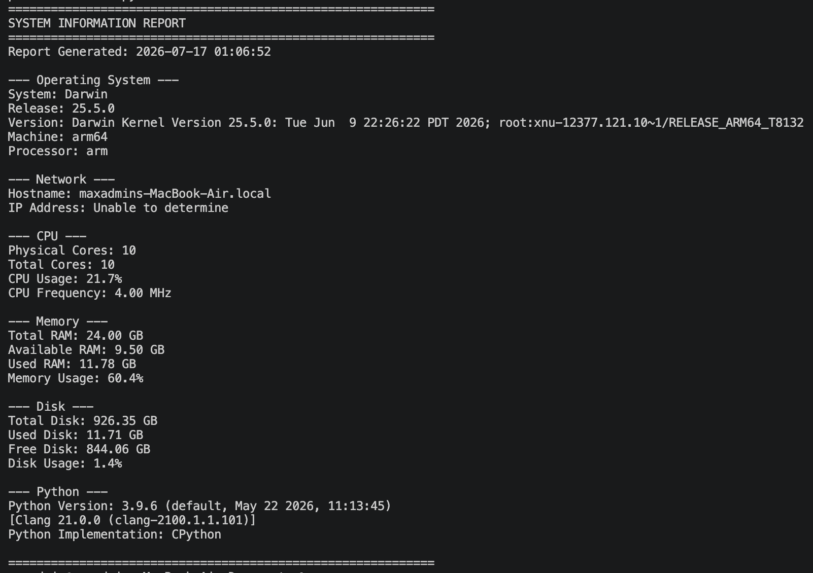

# Check Specs Automation Tool

This tool was created to quickly check specs of devices I manage or diagnose. It pulls information form the machine and displays it in a readable manner.

## What it does

- It helps me collect a lot of information faster
- It assist with less technical people

## Tech stack

- Python
- Docker

## How to run it

### Locally
```
pip install -r requirements.txt
python check-specs-automation.py
```

### With Docker
```
docker build -t check-specs-automation .
docker run --rm check-specs-automation
```

## Sample output



## What I learned / Why I built this

This was my first try creating a Docker image with a Python script. Thanks to it, I increased my hands-on experience with Docker and Python. Furthermore, while I was researching how to properly configure and structure this small project, I learned how a proper GitHub repository should look before it gets pushed. 

Specifically, dealing with dependencies caused me issues because of my lack of understanding. I did not know how to fully utilize the `requirements.txt` document. After researching for a bit (and some AI assistance), I was able to figure out a proper way to create a requirements document. 

Furthermore, I initially had my virtual environment and source files mixed together in the same folder, which taught me the importance of separating environment setup from the code that actually needs to be version-controlled.

Lastly, the Dockerfile itself confused me, however there were a lot of resources on the web which had from complex Dockerfiles to more simple ones.
